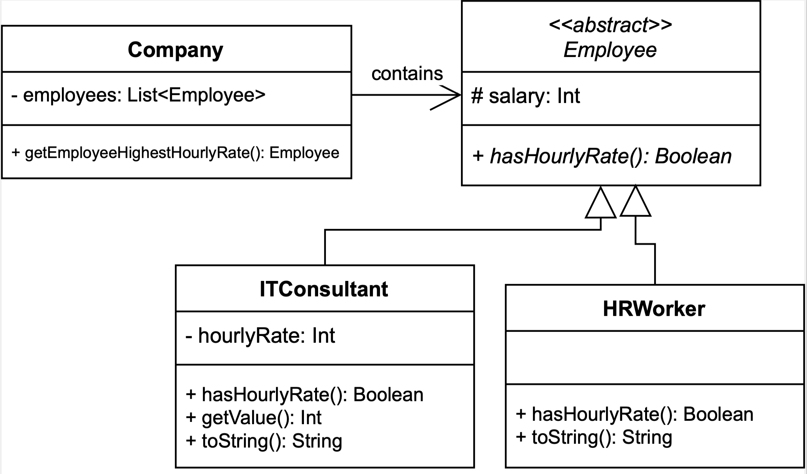

# The 'IT Company' assignment

This is a real Drop Project assignment, used in the 'Programming Languages II' course at the Lusófona University.

It is meant to exercise the students' knowledge of Object Oriented Programming concepts, such as encapsulation and inheritance.

In particular, students are expected to model and implement a solution similar to the one depicted below:

